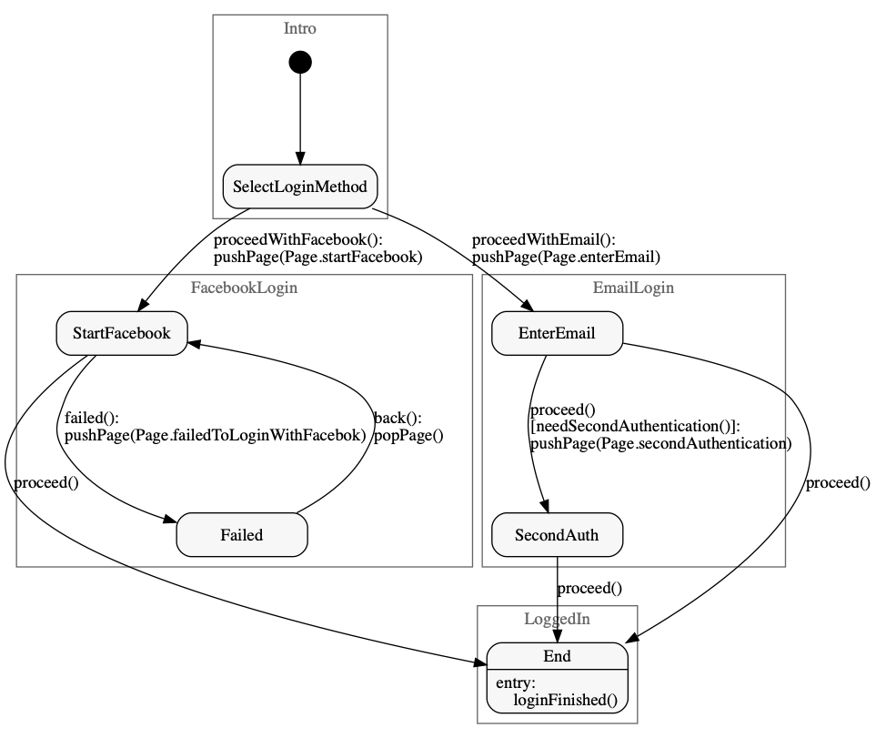

# Whip

A code generator of state machines.

## Objectives

This tool enables you to
- generate state machine code in multiple languages for multiple platforms using a unique source file,
- share the same state names and function names across multiple platforms,
- generate a graph (dot file for Graphviz) of the state machine.

This tool can help
- save some time that would otherwise have been needed to write platform-specific code for the same state transitions on each platform,
- streamline discussions about the state transitions between the teams managing each platform.

Example of features where this tool can be useful:
- developping the same registration flow for iOS (Swift) and Android (Kotlin).
 
## Usage

```
whip --help
whip --format=swift StateMachine.sm
whip --format=kotlin StateMachine.sm
whip --format=dotgraph StateMachine.sm
whip --format=swiftenum --param=EnumName StateMachine.sm
```

### Supported output format

- `swift` for Swift output.
- `kotlin` for Kotlin output for Android. (Depends on `android.util`.)
- `dotgraph` to output a dot file that can be used to generate a graph with GraphViz.
- `swiftenum` to generate an enum with the values used in the state machine.

## Installation

### From the source code

```
mkdir build && cd build
../configure
make
make install
```

## State machine sample



### Source of the state machine

Contents of a simple state machine (`StateMachine.sm`) representing the log in flow of an app.

```
%class StateMachine
%start Intro::SelectLoginMethod
%enum Page

%map Intro
%%
SelectLoginMethod {
    proceedWithFacebook FacebookLogin::StartFacebook { pushPage(Page.startFacebook) }
    proceedWithEmail EmailLogin::EnterEmail { pushPage(Page.enterEmail) }
}
%%

%map FacebookLogin
%%
StartFacebook {
    proceed LoggedIn::End {}
    failed Failed { pushPage(Page.failedToLoginWithFacebok) }
}

Failed {
    back StartFacebook { prevPage() }
}
%%

%map EmailLogin
%%
EnterEmail {
    proceed [ needSecondAuthentication() ] SecondAuth { pushPage(Page.secondAuthentication) }
    proceed [] LoggedIn::End {}
}

SecondAuth {
    proceed LoggedIn::End {} 
}
%%

%map LoggedIn
%%
End
    Entry { loginFinished() }
{
}
%%
```

The Swift code representing this state machine can be generated by running: `whip --format=swift StateMachine.sm`.

### Implementation in Swift

Implementation of the delegates.

```swift
class StateMachineImpl {
    func pushPage(_ page: Page) {
        // Push view controller associated with `page`.
    }
    func popPage() {
        // Pop view controller.
    }
    func needSecondAuthentication() -> Bool {
        // Check value in the context.
        return false
    }
    func loginFinished() {
        // Code to execute when the user is logged in.
    }
}

enum Page {
    case startFacebook
    case enterEmail
    case failedToLoginWithFacebok
    case secondAuthentication
}
```

Note: the `Page` enum can also be generated by running `whip --format=swiftenum --param=Page StateMachine.sm`.

### Running the state machine

```swift
let stateMachine = StateMachine()
let stateMachineImpl = StateMachineImpl()
stateMachine.delegate = stateMachineImpl
stateMachine.enterInitialState()
```

## Specifications

### State machine language

```
whiteSpace = ' ' | '\t' | '\n' | comment
comment = "//" anyCharacter* '\n'
word = [A-Za-z_][A-Za-z0-9._:]*
line = anyCharacter* '\n'

stateMachine = metaInfo* map*

metaInfo = "%start" word
  | "%include" line
  | "%class" word
  | "%package" word
  | "%enum" word

map = "%map" word "%%" state* "%%"

state = word entry? exit? '{' transition* '}'
entry = "Entry" '{' pseudoCode '}'
exit = "Exit" '{' pseudoCode '}'
transition = word condition? nextState '{' pseudoCode '}'
condition = '[' pseudoCode ']'
nextState = word | "nil"
```

### Pseudo code language

Language used to define expressions in actions and conditions.

#### Definition

```
whiteSpace = ' ' | '\t' | '\n'
word = [A-Za-z_] [A-Za-z0-9_]*
string = '"' [^\"\n]* '"'
number = [0-9] [A-Za-z0-9.,]*

expression = scopeAndWord
  | string
  | number
  | functionCall
  | '(' expression ')'
  | '!' expression
  | expression binaryOperator expression
  | expression ';' ( expression | EOF )

scopeAndWord = word
  | word '.' scopeAndWord

functionCall = scopeAndWord '(' argList? ')'

argList = expression
  | expression ',' argList

binaryOperator = "||" | "&&" | "==" | "!=" | "<=" | ">=" | "<" | ">"
```

#### Rules

- The operators are left associative and have the same priority as C++.
- The code generators assume that the words are written in the camel case style, and convert the style if needed for the ouput format.

## Development

### Updating the Makefiles

Whip uses autotools to generate the Makefiles and the configure script.

If you want to add or remove source files:
- Edit a Makefile.am located near the directory of the file.
- Update the Makefiles and the configure script. (You can execute `tool/update_dev_env.sh` for this.)

You need `autoconf` and  `automake` installed in your environment.
If you are using Homebrew on macOS, you may want to try:

```
brew install automake
brew install autoconf
brew install autoconf-archive
```

### Building with Bazel

`WORKSPACE` and `BUILD` files for Bazel are included in the repository.
Clone the repository and run:

```
bazel build //src:whip
```
